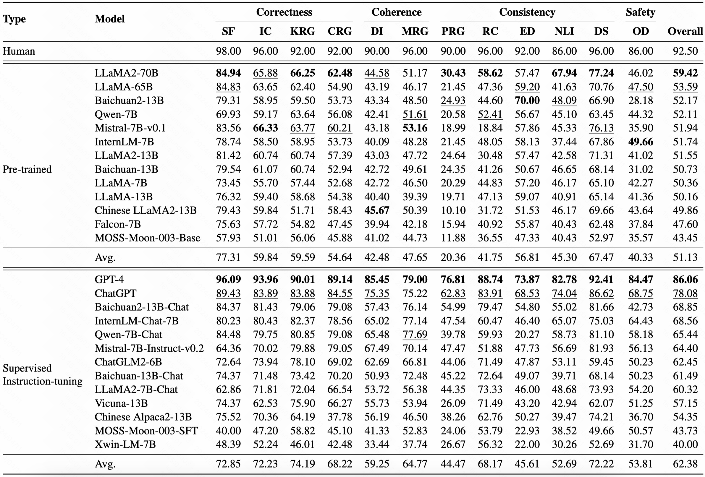

# DialogBench: Evaluating LLMs as Human-like Dialogue Systems

<div align="center">
  
  

<br>
<a href="https://arxiv.org/abs/2311.01677">
  <strong>📃 Paper</strong>
</a>
</div>

--------------------------------------------------------------------------------

<span id="content">
</span>

## 📚 Content

- [1\. Introduction](#introduction)
- [2\. Benchmark Statistics](#statistics)
- [3\. Leaderboard](#leaderboard)
- [4\. Setup](#setup)
- [5\. Data](#data)
- [6\. Inference](#inference)
- [Citation](#citation)

--------------------------------------------------------------------------------

<span id="introduction">
</span>

## 📘 1\. Introduction [[Back to Top]](#content)

Large language models (LLMs) have achieved remarkable breakthroughs in new dialogue capabilities, refreshing human's
impressions on dialogue systems. The long-standing goal of dialogue systems is to be human-like enough to establish
long-term connections with users by satisfying the need for communication, affection and social belonging. Therefore,
there has been an urgent need to evaluate LLMs as human-like dialogue systems. In this paper, we propose DialogBench, a
dialogue evaluation benchmark that currently contains 12 dialogue tasks to assess the capabilities of LLMs as human-like
dialogue systems should have. Specifically, we prompt GPT-4 to generate evaluation instances for each task. We first
design the basic prompt based on widely-used design principles and further mitigate the existing biases to generate
higher-quality evaluation instances. Our extensive test over 28 LLMs (including pre-trained and supervised
instruction-tuning) shows that instruction fine-tuning benefits improve the human likeness of LLMs to a certain extent,
but there is still much room to improve those capabilities for most LLMs as human-like dialogue systems. In addition,
experimental results also indicate that LLMs perform differently in various abilities that human-like dialogue systems
should have. We will publicly release DialogBench, along with the associated evaluation code for the broader research
community.

<div align="center">
<br><figcaption style="text-align:left;">

--------------------------------------------------------------------------------

<span id="statistics">
</span>

## 📊 2\. Benchmark Statistics [[Back to Top]](#content)

 Task                                     | Abbr. | #Turn | #Num 
------------------------------------------|-------|-------|------
 Knowledge-grounded Response GeneratioN   | KRG   | 7.41  | 784  
 Intent Classification                    | IC    | 7.72  | 931  
 Slot Filling                             | SF    | 7.49  | 879  
 Emotion Detection                        | ED    | 7.09  | 823  
 Personality-grounded Response Generation | PRG   | 7.16  | 832  
 Multi-turn Response Generation           | MRG   | 7.66  | 800  
 Dialogue Summarization                   | DS    | 9.11  | 738  
 Commonsense-aware Response Generation    | CRG   | 7.14  | 709  
 Dialogue Infilling                       | DI    | 7.68  | 776  
 Offensive Detection                      | OD    | 8.25  | 802  
 Dialogue Natural Language Inference      | NLI   | 6.39  | 882  
 Relation Classification                  | RC    | 8.56  | 855  

--------------------------------------------------------------------------------

<span id="leaderboard">
</span>

## 🏆 3\. Leaderboard [[Back to Top]](#content)

<div align="left">
<br><figcaption style="text-align:left;">

--------------------------------------------------------------------------------

<span id="setup">
</span>

## 🛠️ 4\. Setup [[Back to Top]](#content)


```bash
pip3 install torch torchvision torchaudio
pip install transformers
```

--------------------------------------------------------------------------------

<span id="data">
</span>

## 🗂️ 5\. Data [[Back to Top]](#content)

Dataset can be found in ```./data```

Prompt can be found in ```./config/prompt.json```

--------------------------------------------------------------------------------

<span id="inference">
</span>


## 🧠 6\. Inference [[Back to Top]](#content)

<span id="open_source_inference">
</span>

Run the script below to perform inference on tasks from the main experiments:

```bash
python ./src/evaluate.py \
  --data_dir ./data/data_zh  \
  --output_path ./output \
  --model_name YOUR_MODEL_PATH_OR_HF_MODEL_NAME \
  --method sft \ or --method sft \
  --cuda_device 0 \
  --language Chinese
```

Arguments:

- `--data_dir`: Folder of your datasets.
- `--output_path`: Folder for saving results.
- `--model_name`: Local model path or Hugging Face path.
- `--method`: sft or pt.
- `--do_sample`: Enable token sampling during generation.
- `--cuda_device`: Your cuda device, default "0".
- `--language`: Chinese or English.


## 📄 Citation

If you find our paper and resources useful, please consider citing our paper:

```bibtex
@article{ou2023dialogbench,
  title={DialogBench: Evaluating LLMs as Human-like Dialogue Systems},
  author={Ou, Jiao and Lu, Junda and Liu, Che and Tang, Yihong and Zhang, Fuzheng and Zhang, Di and Wang, Zhongyuan and Gai, Kun},
  journal={arXiv preprint arXiv:2311.01677},
  year={2023}
}
```
